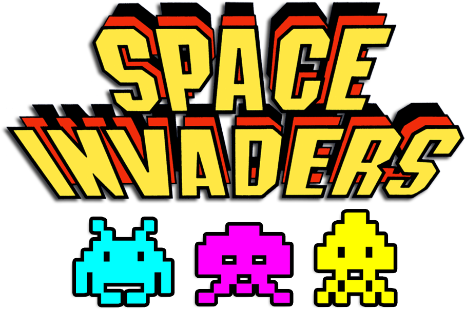

## Space-Invaders
Python Implementation of Space Invaders using Pygame. 

## Dependencies
* Python 2.7+
* pygame 1.9.6+


## Customizing The Game
This game is pretty easy to customize. And users are encouraged to do 
so. 

### General Settings 
Most of the settings you will want to change can be found in 
settings.py. Here you can change the resolution, the background color,
how fast bullets get fired, the max number of bullets a use can fire
at once, how fast aliens drop down the screen etc..

```python
#Screen Settings
self.screen_width = 1200
self.screen_height = 800
self.bg_color = (230, 230, 230)

#Bullet Settings
self.bullet_speed = 1
self.max_bullet_limit = 9

#Alien Settings
self.fleet_drop_speed = 10

#Ship Settings
self.ship_limit = 3

#Speed Settings
self.level_up_scale = 1.1

self.ship_speed_factor = 1.5
self.bullet_speed_factor = 3
self.alien_speed_factor  =  1

#fleet direction of 1 represents right; -1 represents left.
self.fleet_direction = 1

#Points for shooting alien
self.alien_points = 50
```

### Bullet Settings
If you wish to change things such as how wide or long bullets are
or the color in which they appear then these settings can be found
into the __init__() function of the bullets class found in bullets.py
```python
#Settings
self.bullet_width = 500
self.bullet_height = 15
self.bullet_color = 60, 60, 60
```

## Inspiration 
This game was based off Python Crash Course by Eric Matthes